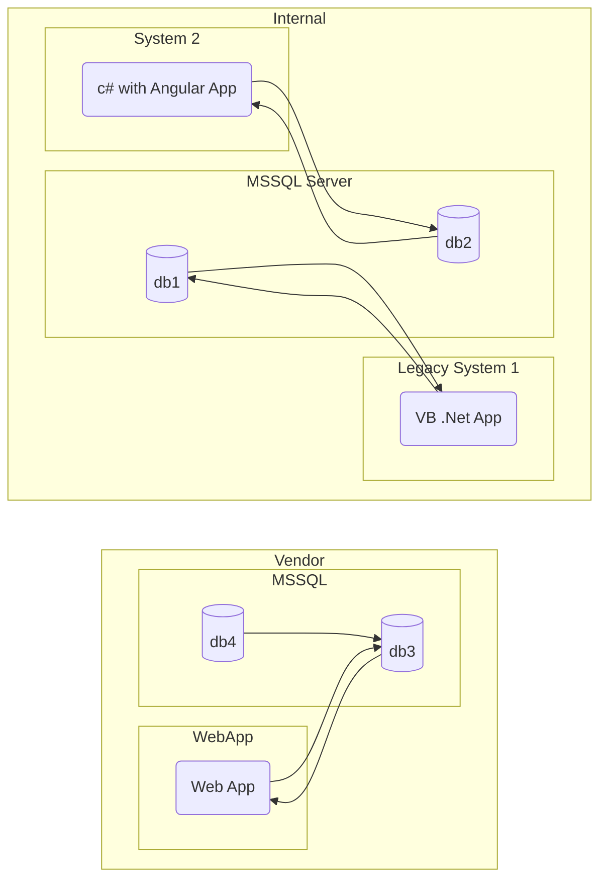

```mermaid

    flowchart LR
    %% Let's setup some objects
        db1[(db1)]
        web1(VB .Net App)
        db2[(db2)]
        web2(c# with Angular App)
        db3[(db3)]
        web3(Web App)
        db4[(db4)]

        subgraph Vendor
        direction LR
            subgraph MSSQL
                db3
                db4 --> db3
            end
            subgraph  WebApp
                web3
            end
            db3 --> web3 --> db3
        end
    subgraph Internal
    direction LR
        subgraph MSSQL Server
            db1
            db2
        end

        subgraph Legacy System 1
            db1 --> web1 --> db1
        end

        subgraph System 2
            db2 --> web2 --> db2
        end
    end

```